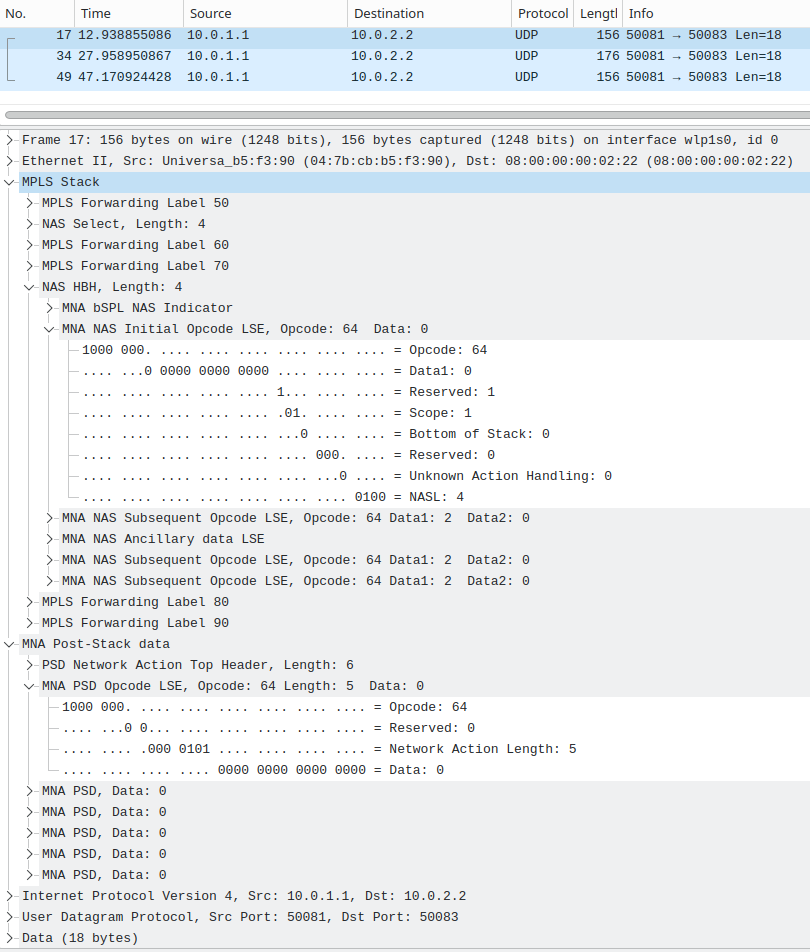

<div align="center">
<h2>P4-MNA: P4 Implementation of the MPLS Network Actions (MNA) Framework</h2>

    [](https://github.com/uni-tue-kn/P4-MNA/actions/workflows/controller.yml) [](https://github.com/uni-tue-kn/P4-MNA/actions/workflows/data_plane.yml)

</div>

## Overview
This repository contains the source code of MPLS Network Action (MNA) implementations in P4 for the Intel Tofino 2 switching ASIC as introduced by the [MPLS Working Group](https://datatracker.ietf.org/wg/mpls/about/).
The MNA in-stack data (ISD) implementation features
- A Readable Label Depth (RLD) of 51 LSEs.
- Parsing and processing of two maximum-sized NAS (select-scoped and HBH-scoped) at an LSR
- An exemplary network action for packet loss measurement using the alternate-marking-method (AMM) (based on [draft-cx-mpls-mna-inband-pm-05](https://datatracker.ietf.org/doc/html/draft-cx-mpls-mna-inband-pm))
- An exemplary network action for bandwidth reservation with network slicing (based on [    draft-li-mpls-mna-nrp-selector-02](https://datatracker.ietf.org/doc/html/draft-cx-mpls-mna-inband-pm))

In the future, a PSD implementation will be added to this repository.

Further, this repository contains a library to build packets in the MNA framework, and a Wireshark dissector to visualize them.

## Installation & Start Instructions

### Data Plane

Go to `P4-Implementation` and compile P4-MNA via `make compile`. 
This compiles the program and copies the resulting configs to the target directory.

Afterwards, start P4-MNA via `make start`.

This requires a fully setup [SDE](https://github.com/p4lang/open-p4studio) with set `$SDE` and `$SDE_INSTALL` environment variables.

### Control Plane

The controller is written in Rust and can be started via `cd Local-Controller && cargo run`. This will build and start the control plane.

Make sure to configure physical ports of your device and add MPLS forwarding rule. An example is given in `main.rs`.


## Utils

### Wireshark Dissector

Place the `utils/wireshark/mna_wireshark.lua` file in your Wireshark lua plugins folder, e.g., in `/usr/lib/x86_64-linux-gnu/wireshark/plugins` (from 'About Wireshark' --> 'Folders').


Note: This plugin replaces the MPLS dissector of Wireshark. It is intended for analysis and debugging of MNA traffic only.

#### Example



### MNA Framework Python Library

The file `utils/scapy/MNA.py` contains a library for building MNA packets. See `utils/scapy/send_mna_packet.py` for examples using the MNA library and sending packets using the `scapy` library.

#### Example Output of an MNA frame
```
| LSE Label: 50, BoS: 0 |, 0x32e3f
| LSE Label: 4, BoS: 0 |, 0x4e40
|  Initial opcode: 64, Scope: SELECT, NASL: 4 BoS: 0 |, 0x80000404
|     Subsq. opcode: 64, NAL: 0 BoS: 0 |, 0x80000400
|     Subsq. opcode: 64, NAL: 0 BoS: 0 |, 0x80000400
|     Subsq. opcode: 64, NAL: 0 BoS: 0 |, 0x80000400
|     Subsq. opcode: 64, NAL: 0 BoS: 0 |, 0x80000400
| LSE Label: 60, BoS: 0 |, 0x3ce3f
| LSE Label: 70, BoS: 0 |, 0x46e3f
| LSE Label: 4, BoS: 0 |, 0x4e40
|  Initial opcode: 64, Scope: HBH, NASL: 4 BoS: 0 |, 0x80000a04
|     Subsq. opcode: 64, NAL: 1 BoS: 0 |, 0x80000401
|          Data entry BoS 0 |, 0x80000000
|     Subsq. opcode: 64, NAL: 0 BoS: 0 |, 0x80000400
|     Subsq. opcode: 64, NAL: 0 BoS: 0 |, 0x80000400
| LSE Label: 80, BoS: 0 |, 0x50e3f
| LSE Label: 90, BoS: 0 |, 0x5ae3f
```

### MNA Evaluation
The directory `evaluation` contains files that script traffic generation using the traffic generator P4TG which was used for the evaluation in the paper.

## Citing P4-MNA

If you use P4-MNA in any of your publications, please cite the following paper:
- [F. Ihle and M.Menth, MPLS Network Actions: Technological Overview and P4-Based Implementation on a High-Speed Switching ASIC](https://arxiv.org/abs/2410.20400), preprint, Feb. 2025, (under submission)